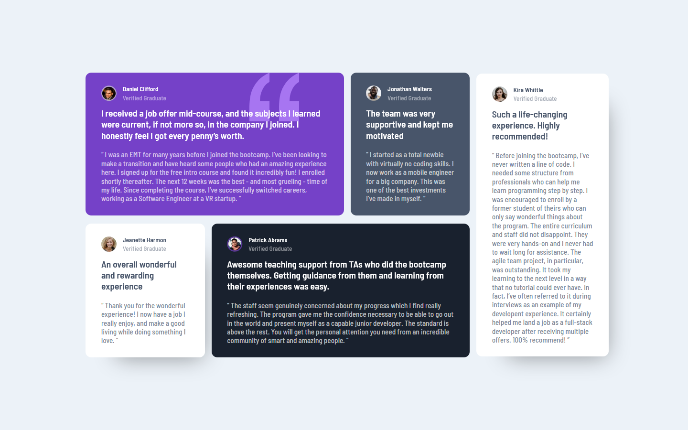

# Frontend Mentor - Testimonials grid section

## Welcome! 👋

# Frontend Mentor - Testimonials grid section solution

This is a solution to the [Testimonials grid section challenge on Frontend Mentor](https://www.frontendmentor.io/challenges/testimonials-grid-section-Nnw6J7Un7). Frontend Mentor challenges help you improve your coding skills by building realistic projects.

## Table of contents

- [Overview](#overview)
  - [The challenge](#the-challenge)
  - [Screenshot](#screenshot)
  - [Links](#links)
- [My process](#my-process)
  - [Built with](#built-with)
- [Author](#author)

## Overview

### The challenge

Users should be able to:

- View the optimal layout for the site depending on their device's screen size

### Screenshot

### Links

- Solution URL: [Add solution URL here](https://https://www.frontendmentor.io/challenges/testimonials-grid-section-Nnw6J7Un7/hub/testimonials-grid-section-Df60L_RI8/edit)
- Live Site URL: [Add live site URL here](https://b4n1y4.github.io/testimonials-grid-section/)

## My process

### Built with

- Semantic HTML5 markup
- CSS custom properties
- Flexbox
- CSS Grid
- Mobile-first workflow

## Author

- Website - [Ritesh Gupta](https://github.com/b4n1y4)
- Frontend Mentor - [@b4n1y4](https://www.frontendmentor.io/profile/b4n1y4)
- Twitter - [@b4n1y4](https://www.twitter.com/b4n1y4)
